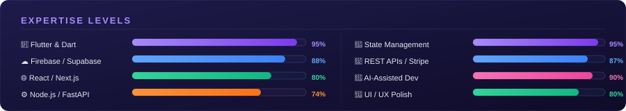

<div align="center">


</div>

<div align="center">

[](https://git.io/typing-svg)

</div>

<div align="center">

[](https://linkedin.com/in/asherayub80)
[](mailto:asherayub80@gmail.com)
[](https://portfolio-asherayub.vercel.app)
[](https://github.com/AsherAyub80)
[](https://github.com/AsherAyub80)

</div>

---

## 🧑‍💻 About Me

```dart
class AsherAyub extends FlutterDeveloper {

  // 🏙️  Based in Karachi, Pakistan
  // 💼  Currently @ DotClick LLC
  // 🎓  B.S. Software Engineering — Virtual University of Pakistan

  final String primaryStack   = "Flutter · Dart · Firebase";
  final String webStack       = "React · Next.js · Node.js · FastAPI";
  final String cloudStack     = "Supabase · PostgreSQL · MongoDB · Vercel";
  final String aiTools        = "Cursor · Claude Code · Lovable · OpenAI Codex";

  final int appsShipped       = 8;           // iOS + Android + Web
  final int sectorsDelivered  = 6;           // booking · healthcare · social · food · real estate · wellness

  Future<void> dailyRoutine() async {
    await drinkCoffee();
    await writeCleanCode();
    await shipToProduction();
    await learnSomethingNew();
  }

  List<String> interests = [
    "🤖  AI / Machine Learning",
    "⛓️   Blockchain Technology",
    "🎮  Video Game Development",
  ];
}
```

---
 
## 📈 Expertise Levels
 
<div align="center">

</div>

---

## 🛠️ Full Tech Stack

<div align="center">

### 📱 Mobile Development


### 🔄 State Management


### 🌐 Frontend & Backend


### 🗄️ Databases & Cloud


### 🔌 Payments & Integrations


### 🤖 AI-Assisted Development


### 🧰 Tools & Platforms


</div>

---

## 🚀 Featured Projects

> 8 production apps delivered across **Booking · Healthcare · Social · Food Delivery · Real Estate · Wellness**

<table>
<thead>
<tr>
<th>Project</th>
<th>Description</th>
<th>Stack</th>
<th>Sector</th>
</tr>
</thead>
<tbody>

<tr>
<td><b>✂️ VIB Barber</b></td>
<td>On-demand barber booking with real-time scheduling, service & availability management, and a full RevenueCat subscription flow — live on both stores</td>
<td>
  
  
  
</td>
<td><code>📅 Booking</code></td>
</tr>

<tr>
<td><b>🧒 KiddoKit</b></td>
<td>Therapy companion for therapists, educators & children — visual schedules, token reward boards, and progress tracking built for accessibility and daily clinical use</td>
<td>
  
  
  
</td>
<td><code>🏥 Healthcare</code></td>
</tr>

<tr>
<td><b>🍔 Moogose Burger</b></td>
<td>Food ordering & delivery app with real-time order pipeline, Stripe payments, and a Node.js + MongoDB backend handling menu, orders, and delivery state</td>
<td>
  
  
  
  
</td>
<td><code>🍕 Food Delivery</code></td>
</tr>

<tr>
<td><b>🎬 Shined</b></td>
<td>Short-video social platform with real-time Socket.io chat, content discovery feed, follow/interaction systems, and clean GetX architecture throughout</td>
<td>
  
  
  
</td>
<td><code>📲 Social</code></td>
</tr>

<tr>
<td><b>🧠 MindfulMeals</b></td>
<td>Full-stack wellness app with AI-driven meal & restaurant recommendations (Groq + pgvector), GPS discovery, social feed, and an 8-page React admin panel wired to the live API</td>
<td>
  
  
  
  
</td>
<td><code>🥗 Wellness · AI</code></td>
</tr>

<tr>
<td><b>🚗 NextDrive</b></td>
<td>Accident-replacement vehicle platform for an Australian client — responsive mobile-first UI, polished global animation system, admin panel deployed to production on Vercel</td>
<td>
  
  
  
  
</td>
<td><code>🏢 Real Estate · Auto</code></td>
</tr>

<tr>
<td><b>🏪 Business Marketplace</b></td>
<td>B2B marketplace with OTP-verified contact reveal, tiered subscription plans, and a super-admin billing panel managing listings and user roles</td>
<td>
  
  
  
  
</td>
<td><code>🤝 B2B · SaaS</code></td>
</tr>

<tr>
<td><b>🧘 Chiezda</b></td>
<td>Wellness app with mindfulness tools, gratitude journaling, community features, and push notifications — RevenueCat subscription flow synced across both stores</td>
<td>
  
  
  
</td>
<td><code>🧘 Wellness</code></td>
</tr>

</tbody>
</table>

---
## 📦 Open Source Packages

### 📊 [flutter_sales_graph](https://pub.dev/packages/flutter_sales_graph)

A highly customizable bar chart package for Flutter designed to display sales trends and data metrics smoothly across all platforms.


---

#### ✨ Features
- 📊 Smooth animated bar chart rendering
- ⚡ Lightweight and high-performance UI
- 🎨 Fully customizable styles (colors, spacing, labels)
- 📱 Responsive across all screen sizes
- 🌍 Cross-platform support (Android, iOS, Web, Desktop)
- 🧠 Built for real-world production dashboards

---

#### 🚀 Why this package
- Designed for real analytics & sales dashboards
- Clean and minimal API design
- Zero unnecessary dependencies
- Production-tested performance

---

#### 🧪 Quality
- ✔ Pana Score: 160/160
- ✔ Fully linted & production-ready
- ✔ Optimized for smooth rendering performance
- ✔ Follows Flutter best practices

---

- **Platform Target:** Universal support for Android, iOS, Web, Windows, macOS, and Linux.
---


## 📊 GitHub Stats

<div align="center">


</div>

<div align="center">

[](https://git.io/streak-stats)

</div>

<div align="center">

[](https://github.com/ashutosh00710/github-readme-activity-graph)

</div>

---

## 💼 Professional Experience

<table>
<tr>
<td width="8%" align="center">🏢</td>
<td width="42%"><b>Flutter & Frontend Developer</b><br/><i>DotClick LLC — Karachi, Pakistan</i></td>
<td width="20%"><code>Nov 2024 – Present</code></td>
<td width="30%">Agile team · Android & iOS release pipelines · Real-time booking systems · React admin panels with RBAC</td>
</tr>
<tr>
<td align="center">🏢</td>
<td><b>Flutter Developer</b><br/><i>Alisons Technology — Karachi, Pakistan</i></td>
<td><code>Oct 2024 – Nov 2024</code></td>
<td>Flutter Android & iOS · State management · REST API integration</td>
</tr>
</table>

---


## 🎓 Education

<table>
<tr>
<td width="8%" align="center">🎓</td>
<td><b>Bachelor of Science in Software Engineering (BSSE)</b><br/><i>Virtual University of Pakistan</i> — <code>2023 – Present</code></td>
</tr>
</table>

---

## 🌍 Open To

<div align="center">

| 🤝 Freelance Projects | 💼 Full-Time Roles | 🌐 Remote Work | 🚀 Open Source |
|:---:|:---:|:---:|:---:|
| Mobile & Web Apps | Flutter / React Dev | Worldwide | Contributions |

</div>

---

## 📫 Get In Touch

<div align="center">

**Building something cool? Let's talk.**

[](https://linkedin.com/in/asherayub80)
[](https://portfolio-asherayub.vercel.app)
[](mailto:asherayub80@gmail.com)

</div>

---

<div align="center">


</div>

<div align="center">


<sub>⚡ Crafted with Flutter-grade precision by <a href="https://github.com/AsherAyub80">Asher Ayub</a></sub>

</div>
